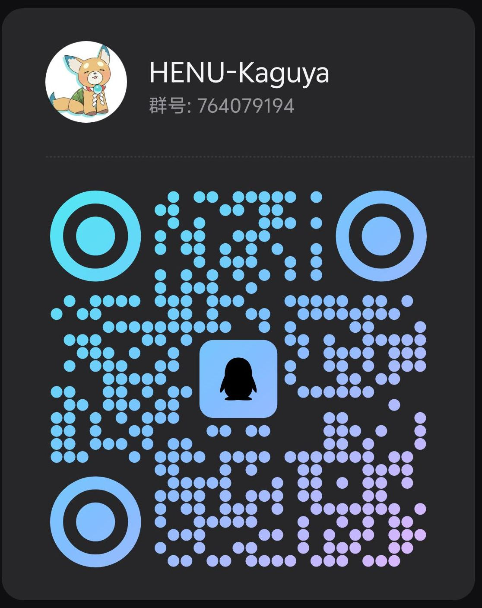

# 河南大学计算机科学与技术资料合集 (HENU)

> **本项目主要用于收集和整理河南大学计算机科学与技术专业各门课程的试卷、习题、知识点等资料。**
>
> **声明**：本项目无任何盈利，不允许售卖。更新时间不定，随缘更新。

> [!WARNING]
> **关于本项目开源协议 (CC BY-NC-SA 4.0) 的重要说明与违规后果**
> 
> 本项目采用 **CC BY-NC-SA 4.0 (署名-非商业性使用-相同方式共享 4.0 国际)** 许可协议。为防范因不了解协议而产生的侵权行为，请务必知悉以下条款：
> 
> 1. **核心限制（必须遵守）**：
>    - **非商业性使用 (NonCommercial)**：**严禁将本项目中的任何内容用于商业用途**。不得以任何形式售卖本项目资料、将其放入付费群、设置付费下载或进行其他盈利活动。
>    - **署名 (Attribution)**：如果您转载、分享或引用本项目的内容，必须给出适当的署名（标注本项目来源及作者），并提供指向本协议的链接。
>    - **相同方式共享 (ShareAlike)**：如果您对本项目的内容进行了修改、重混或二次创作，您必须基于**相同协议 (CC BY-NC-SA 4.0)** 分发您的修改版。
> 
> 2. **违规后果与责任（违反协议的惩罚）**：
>    - **授权自动终止**：根据协议 Section 6(a) 条款，一旦您违反协议中的任何条款（如私自售卖、未署名等），**您对本项目所有内容的授权将自动终止**。此后您继续持有、使用或传播本项目内容均属于**侵权行为**。
>    - **追究法律责任**：版权所有者保留追究侵权者法律责任的权利。我们有权向托管平台（如 GitHub）、销售渠道（如淘宝、闲鱼、拼多多）或相关部门投诉并要求下架，并保留索赔的权利。
>    - **声誉与公开曝光**：对于恶意售卖、剽窃本项目资料的行为，一经发现，我们将在项目首页及相关社群对违规账号/人员进行**公开曝光**。

---

## 各科资料仓库

- **软件工程 (Software Engineering)**: [Software Engineering](https://github.com/Henu-Kaguya/Software-Engineering)
- **操作系统 (Operating System)**: [Operating System](https://github.com/Henu-Kaguya/Operating-System)
- **计算机网络 (Computer Network)**: [Computer Network](https://github.com/Henu-Kaguya/Computer-Network)
- **机器学习 (Machine Learning)**: [Machine Learning](https://github.com/Henu-Kaguya/Machine-Learning)
- **数据库原理 (Database Principles)**: [Database Principles](https://github.com/Henu-Kaguya/Database-Principles)
- **计算机体系结构 (Computer Architecture)**: [Computer Architecture](https://github.com/Henu-Kaguya/Computer-Architecture)
- **计算机图形学 (Computer Graphics)**: [Computer Graphics](https://github.com/Henu-Kaguya/Computer-Graphics)
- **编译原理 (Compiler Principles)**: [Compiler Principles](https://github.com/Henu-Kaguya/Compiler-Principles)
- **计算机组织原理 (Principles of Computer Organization)**: [Principles-of-Computer-Organization](https://github.com/Henu-Kaguya/Principles-of-Computer-Organization)
- **运筹学 (Operational Research)**: [Operational-Research](https://github.com/Henu-Kaguya/Operational-Research)
- **数字图像处理 (Digital Image Processing)**: [Digital-Image-Processing](https://github.com/Henu-Kaguya/Digital-Image-Processing)
- **C#程序设计 (CSharp Programming)**: [CSharp-Programing](https://github.com/Henu-Kaguya/CSharp-Programing)
  - **C#程序设计Demo (CSharp Programming Demo)**: [CSharp-Programing-Demo](https://github.com/Henu-Kaguya/CSharp-Programing-Demo)
- **C#网络应用编程 (CSharp Network Application Programming)**: [CSharp-Network-Application-Programming](https://github.com/Henu-Kaguya/CSharp-Network-Application-Programming)
  - **C#网络应用编程Demo (CSharp Network Demo)**: [CSharp-Network-Demo](https://github.com/Henu-Kaguya/CSharp-Network-Demo)
- **C Primer Plus程序设计 (C Primer Plus Programming)**: [C-Primer-Plus-Programming](https://github.com/Henu-Kaguya/C-Primer-Plus-Programming)
- **算法设计与分析 (Algorithmic Design and Analysis)**: [Algorithmic-Design-and-Analysis](https://github.com/Henu-Kaguya/Algorithmic-Design-and-Analysis)
- **电路与电子学基础 (Basic Circuit and Electronics)**: [Basic-Circuit-and-Electronics](https://github.com/Henu-Kaguya/Basic-Circuit-and-Electronics)
- **计算思维与创新 (Computational Thinking and Innovation)**: [Computational-Thinking-and-Innovation](https://github.com/Henu-Kaguya/Computational-Thinking-and-Innovation)
- **计算机导论 (Introduction to Computer Science)**: [Introduction-to-Computer-Science](https://github.com/Henu-Kaguya/Introduction-to-Computer-Science)
- **离散数学 (Discrete Mathematics)**: [Discrete-Mathematics](https://github.com/Henu-Kaguya/Discrete-Mathematics)
- **逻辑设计 (Logic Design)**: [Logic-Design](https://github.com/Henu-Kaguya/Logic-Design)
  - **逻辑设计实验 (Experiment of Logic Design)**: [Experiment-of-Logic-Design](https://github.com/Henu-Kaguya/Experiment-of-Logic-Design)
- **计算机系统概论 (Introduction to Computer Systems)**: [Introduction-to-Computer-Systems](https://github.com/Henu-Kaguya/Introduction-to-Computer-Systems)
- **自然语言处理 (Natural Language Processing)**: [Natural-Language-Processing](https://github.com/Henu-Kaguya/Natural-Language-Processing)
- **计算机伦理 (Computer Ethics)**: [Computer-Ethics](https://github.com/Henu-Kaguya/Computer-Ethics)
- **计算机科学与技术小学期 (CS Small Term)**: [CS-Small-Term](https://github.com/Henu-Kaguya/CS-Small-Term)

---

## 联系

- **QQ(同邮箱)**: `2734165908`
- **QQ群**: `764079194`
  - **群链接**: https://qm.qq.com/q/EUcy3z15Uk

> 

---

## 工具与资源推荐

### 文本提取 / OCR

- Gemini
- Pixin
- DeepSeek

### 编辑工具

- VSCode
- Typora
- Obsidian

### CSDN 解锁

- 如果需要看某一个文章,推荐闲鱼购买共享账号（1~2天会员）。

---

## 推荐阅读

- [提问的艺术 (The Smart Way)](https://github.com/ryanhanwu/How-To-Ask-Questions-The-Smart-Way/blob/main/README-zh_CN.md)
- [HENU-CS](https://github.com/HENU-CS)
- [CS 自学指南](https://csdiy.wiki/)
- [CS 国外中文课程资源](https://www.learncs.site/)
- [DeepWiki](https://deepwiki.com/)
- [日语学习资料](https://my.feishu.cn/wiki/YeOSwsG7giLuQxkcDFscUXVZn2f)

### 视频推荐

- [【考试周破防】4K高清重制版](https://www.bilibili.com/video/BV1XM4y1c7Jp)

## 开源协议 / License

本项目采用 [CC BY-NC-SA 4.0 (署名-非商业性使用-相同方式共享)](LICENSE) 许可协议。
